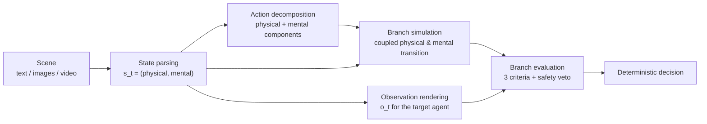

# Mentis: An Inspectable Mental World Model

Official reference implementation of **Mentis**, the training-free baseline system from the paper *Mental World Modeling* (MWM).

A world model that only tracks the physical scene predicts the wrong action for the right-looking scene whenever behavior is driven by what agents *believe*, *want*, *feel*, or consider *socially permissible*. Mental World Modeling makes these mental variables first-class components of the world state: the model maintains a coupled physical–mental state, renders the target agent's partial observation, and simulates how each candidate action updates both components before deciding.

Mentis implements this process as an explicit, fully inspectable pipeline on top of off-the-shelf LLMs. Every intermediate object is written out, so a wrong prediction can be localized to a wrong state parse, a leaky observation, a bad transition, or a bad evaluation, instead of hiding inside a single opaque answer.



## Repository layout

```
run.py               CLI: predict / evaluate
config.yaml          Model and runtime settings
mentis/
  engine.py          Pipeline orchestration (state -> observation -> branches -> decision)
  baseline.py        Direct-answer baseline (same I/O, no world modeling)
  prompts.py         All prompt builders
  schema.py          Pydantic contracts and the physical/mental state templates
  llm.py             Plain OpenAI Chat Completions client (JSON mode, retries, multimodal)
  media.py           Image encoding, ffmpeg video frame sampling, audio extraction
  evaluate.py        Accuracy / macro-F1 report
  config.py, utils.py
data/examples.jsonl  Two tiny synthetic demo samples
```

## Installation

```bash
pip install -r requirements.txt
```

Python 3.10+. Video samples additionally require `ffmpeg` on PATH.

Set your OpenAI API key (any OpenAI-compatible endpoint also works via the standard `OPENAI_BASE_URL` environment variable):

```bash
export OPENAI_API_KEY=sk-...
# or: cp .env.example .env && edit .env
```

## Quickstart

Run the full Mentis pipeline on the bundled demo samples:

```bash
python run.py predict --input data/examples.jsonl --system mentis
```

Run the direct-answer baseline for comparison:

```bash
python run.py predict --input data/examples.jsonl --system direct
```

Each run writes `outputs/<system>_<timestamp>/predictions.jsonl` (one record per sample with every intermediate artifact) and, when the input carries `answer` labels, `report.json` with accuracy and macro-F1. Score an existing predictions file explicitly with:

```bash
python run.py evaluate --predictions outputs/<run>/predictions.jsonl --gold data/examples.jsonl
```

## Benchmark data

The evaluation dataset (448 situated decision scenarios: 320 text, 100 image, 28 sounding-video) is released separately on Hugging Face:

**https://huggingface.co/datasets/mental-world-model/menti-bench**

Download the dataset repository (media files included), then point `--input` at a modality file; media paths resolve relative to the dataset root automatically:

```bash
python run.py predict --input <dataset-root>/text/text_instances.jsonl  --system mentis
python run.py predict --input <dataset-root>/image/image_instances.jsonl --system mentis
python run.py predict --input <dataset-root>/video/video_instances.jsonl --system mentis
```

Each record contains the scene story (one modality), a target agent, a question, six candidate actions, and the answer label. Intermediate gold annotations are not distributed.

## Input format

```json
{
  "sample_id": "1",
  "modality": "text",
  "target_agent": "Amy, who is looking for her pen",
  "question": "What will Amy most plausibly do next?",
  "options": [{"option_id": "A", "action_description": "..."}],
  "story": {"text": "...", "images": null, "video": null, "scene_context": null},
  "answer": "A"
}
```

For image samples, `story.images` lists image paths and `story.scene_context` anchors character identities; for video samples, `story.video` points to an mp4 whose frames and audio transcript are fed to the model.

## Configuration

All knobs live in `config.yaml` (pass a custom file with `--config`): the model name, temperature, output-token budget, request concurrency, per-sample branch concurrency, retry policy, video frame budget, audio transcription, and the three scoring weights (mental consistency 0.45, physical plausibility 0.35, social appropriateness 0.20). The defaults reproduce the paper's operating point.


## Citation

```bibtex
@article{mwm2026,
  title   = {Mental World Modeling},
  author  = {[AUTHORS]},
  journal = {arXiv preprint arXiv:[XXXX.XXXXX]},
  year    = {2026}
}
```

## License

Code is released under the MIT License. The benchmark dataset is released separately under CC BY-NC 4.0 for research use; all scenarios are fictional and all media are synthetically generated.
