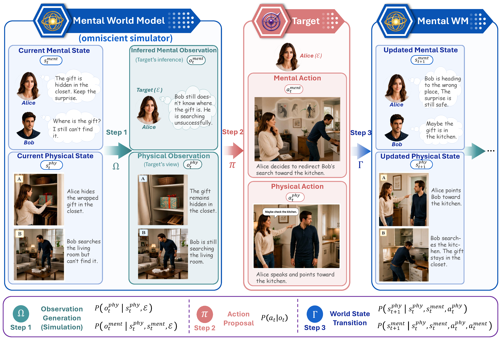
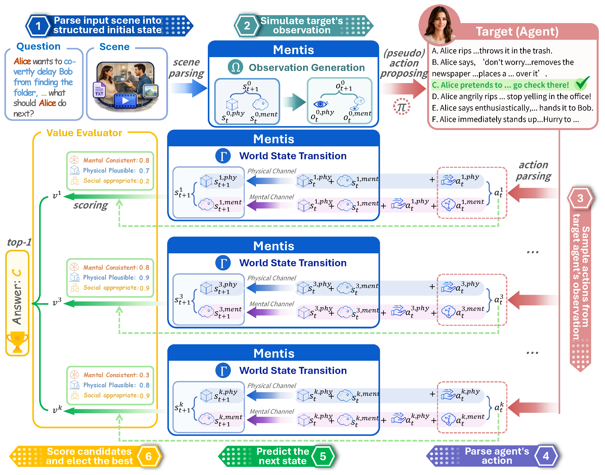

<p align="center">
  
</p>

<h1 align="center">Mental World Modeling</h1>

<p align="center">
  <b>Official implementation of the paper "Mental World Modeling": the <i>Mentis</i> system and the <i>Menti-Bench</i> evaluation suite</b>
</p>

<p align="center">
  <a href="https://arxiv.org/abs/2607.27201"></a>
  <a href="https://mental-world.github.io/"></a>
  <a href="https://huggingface.co/datasets/mental-world-model/menti-bench"></a>
  <a href="LICENSE"></a>
  <a href="https://huggingface.co/datasets/mental-world-model/menti-bench"></a>
  
</p>

<p align="center">
  <a href="https://haofei.vip">Hao Fei</a><sup>1</sup>&nbsp;&nbsp;
  Yiran Zhao<sup>2</sup>
  <br>
  <sup>1</sup>University of Oxford&nbsp;&nbsp;&nbsp;<sup>2</sup>National University of Singapore
  <br>
</p>

<p align="center">
  <a href="https://arxiv.org/abs/2607.27201">📄 Paper</a> ·
  <a href="https://mental-world.github.io/">🌐 Project Page</a> ·
  <a href="https://huggingface.co/datasets/mental-world-model/menti-bench">🤗 Menti-Bench</a> ·
  <a href="https://github.com/mental-world/Mentis/issues">🐛 Issues</a>
</p>

---


https://github.com/user-attachments/assets/7a120026-9379-40ae-a304-fd29b382b69d


**Mental World Modeling (MWM)** extends world models beyond the physical question of *what is where and how it evolves*: an MWM maintains a coupled **physical–mental world state**, renders each agent's **partial observation**, and simulates how candidate actions jointly update both the scene and the minds inside it. **Mentis** is the training-free, fully inspectable reference system that instantiates this process on top of off-the-shelf LLMs.

## 🔥 News

- **[2026-08]** 🎉 Initial public release: Mentis code and the full Menti-Bench evaluation set (448 instances across text / image / sounding-video).
- **[2026-07]** 📄 The MWM paper is on arXiv: [arXiv:2607.27201](https://arxiv.org/abs/2607.27201).

## 📋 Table of Contents

- [Overview](#-overview)
- [Key Features](#-key-features)
- [Architecture](#-architecture)
- [Repository Layout](#-repository-layout)
- [Getting Started](#-getting-started)
- [Quickstart](#-quickstart)
- [Menti-Bench](#-menti-bench)
- [Configuration](#-configuration)
- [Output Format](#-output-format)
- [Evaluation](#-evaluation)
- [FAQ](#-faq)
- [Citation](#-citation)
- [License](#-license)
- [Contact](#-contact)

## 🧠 Overview

Human behavior is driven by hidden mental state: what a person **believes**, **wants**, **intends**, **feels**, and considers **socially permissible**. A world model that tracks only the physical scene therefore predicts the wrong action for the right-looking scene whenever these variables carry the causal load — someone searching for an object that was silently moved, trusting a promise that was silently broken, or misreading a signal others can see is wrong.

MWM makes mental variables first-class components of the world state rather than post-hoc rationales. Given a situated scene, a designated target agent, and a set of candidate actions, the model must:

1. parse the scene into a joint state $s_t = (s_t^{phy}, s_t^{ment})$;
2. render the target's partial observation $o_t$ (what the target can actually see, hear, know, and infer);
3. decompose each candidate action into its physical carrier and its mental/social effect;
4. simulate the coupled physical–mental successor state for every branch;
5. evaluate the imagined futures and select the action the target would actually take.

<p align="center">
  
</p>

Mentis executes exactly this pipeline with explicit, logged intermediate objects. When a prediction is wrong, the failure can be **localized** — a wrong state parse, a leaky observation, an implausible transition, or a bad evaluation — instead of hiding inside one opaque answer. This is what makes Mentis useful as a *measurement instrument* for studying where current LLMs break as mental world models.

## ✨ Key Features

- **Training-free** — works with any OpenAI-compatible chat model out of the box; no fine-tuning, no bespoke infrastructure.
- **Fully inspectable** — every stage writes its artifact (parsed state, rendered observation, decomposed actions, successor states, score table, decision trace) into the prediction record.
- **Coupled physical–mental transitions** — both channels condition on the full joint state; the mental update is grounded in the predicted physical carrier.
- **Principled decision rule** — three normalized criteria (mental consistency, physical plausibility, social appropriateness) with a safety veto, comparative ranking, and a deterministic, seeded tie-break outside the LLM.
- **Natively multimodal** — text stories, ordered image sequences, and sounding videos (ffmpeg frame sampling + audio transcription).
- **Benchmark-ready CLI** — one command to predict, one to score; accuracy and macro-F1 reported overall and per modality / scenario category.

## 🏗️ Architecture

<p align="center">
  
</p>

| Stage | Module | What it does |
|---|---|---|
| 1. State parsing | `engine._parse_state` | Maps the raw scene (text / images / video+audio) into the strict joint state schema $\hat{s}_t$ |
| 2. Observation rendering | `engine._render_observation` | Filters $\hat{s}_t$ into the target's first-person observation $\hat{o}_t$; no mind reading, no leaked facts |
| 3. Action decomposition | `engine._decompose_actions` | Splits each option into a physical carrier and a mental/social component |
| 4. Branch simulation | `engine._simulate_branch` | Predicts the physical successor, then the mental successor conditioned on it; merges into $\hat{s}_{t+1}^{k}$ |
| 5. Branch evaluation | `engine._score_branches` | Grades all branches in one shared context on three criteria + safety veto + strict comparative rank |
| 6. Decision | `engine.select_action` | Deterministic weighted selection with seeded tie-breaking, outside the LLM |

## 📁 Repository Layout

```
Mentis/
├── run.py                 CLI entry point: predict / evaluate
├── config.yaml            Model and runtime settings (paper operating point)
├── requirements.txt
├── data/
│   └── examples.jsonl     Two tiny synthetic demo samples
├── assets/                Figures used in this README
└── mentis/
    ├── engine.py          Pipeline orchestration and decision rule
    ├── baseline.py        Direct-answer baseline (same I/O, no world modeling)
    ├── prompts.py         All prompt builders
    ├── schema.py          Pydantic contracts + physical/mental state templates
    ├── llm.py             OpenAI Chat Completions client (JSON mode, retries, multimodal)
    ├── media.py           Image encoding, ffmpeg frame sampling, audio extraction
    ├── evaluate.py        Accuracy / macro-F1 reporting
    ├── config.py          Settings loading (YAML + .env)
    └── utils.py           JSONL I/O, JSON repair, bounded concurrency
```

## 🚀 Getting Started

**Requirements**: Python 3.10+; `ffmpeg` on PATH for video samples.

```bash
git clone https://github.com/mental-world/Mentis.git
cd Mentis
pip install -r requirements.txt
```

Set your OpenAI API key (any OpenAI-compatible endpoint also works via the standard `OPENAI_BASE_URL` variable):

```bash
export OPENAI_API_KEY=sk-...
# or: cp .env.example .env  &&  edit .env
```

## ⚡ Quickstart

Run the full Mentis pipeline on the bundled demo samples:

```bash
python run.py predict --input data/examples.jsonl --system mentis
```

Run the direct-answer baseline on the same samples for comparison:

```bash
python run.py predict --input data/examples.jsonl --system direct
```

Typical console output:

```
Running mentis on 2 sample(s) with model gpt-5.5
[1/2] sample=demo_1 status=success prediction=A calls=12 elapsed=41.3s
[2/2] sample=demo_2 status=success prediction=B calls=12 elapsed=38.9s
Wrote outputs/mentis_20260816-120001/predictions.jsonl
samples=2 predictions=2 accuracy=1.0000 macro_f1=1.0000 failure_rate=0.0000
```

Each run directory contains `predictions.jsonl` (one record per sample with **all** intermediate artifacts) and, when the input carries `answer` labels, `report.json`.

## 📊 Menti-Bench

The full evaluation set is hosted on Hugging Face: **[mental-world-model/menti-bench](https://huggingface.co/datasets/mental-world-model/menti-bench)** — 448 manually constructed, quality-controlled situated decision scenarios.

| Config | Instances | Story carrier | Media |
|---|---:|---|---|
| `text` | 320 | narrative prose | — |
| `image` | 100 | ordered image sequence + identity anchors | 282 images |
| `video` | 28 | sounding video + identity anchors | 28 mp4 clips |

Wrong options are hardened to each violate at least one constraint inferable from the scene (a character's belief or perceptual access, an object's state, an agreement, a norm, or timing). Intermediate gold annotations (gold states / observations / successors) are **not** distributed, so the benchmark cannot be shortcut with oracle information.

Download the dataset (media included) and run any modality directly — media paths resolve against the dataset root automatically:

```bash
hf download mental-world-model/menti-bench --repo-type dataset --local-dir menti-bench

python run.py predict --input menti-bench/text/text_instances.jsonl   --system mentis
python run.py predict --input menti-bench/image/image_instances.jsonl --system mentis
python run.py predict --input menti-bench/video/video_instances.jsonl --system mentis
```

<details>
<summary><b>Input record format</b> (click to expand)</summary>

```json
{
  "sample_id": "51",
  "modality": "image",
  "domain": "...", "domain_category": "...",
  "scene": "...", "scene_category": "interpersonal_decision",
  "num_of_characters": 3,
  "target_agent": "who the question is about, with identifying description",
  "question": "What will the target most plausibly do next?",
  "options": [
    {"option_id": "A", "action_description": "..."},
    {"option_id": "B", "action_description": "..."}
  ],
  "story": {
    "text": null,
    "images": ["image/assets/51_01.jpg", "image/assets/51_02.jpg"],
    "video": null,
    "scene_context": "identity anchors for the people shown in the media"
  },
  "answer": "C"
}
```

Exactly one of `story.text` / `story.images` / `story.video` is non-null. For videos, sampled frames and the audio transcript are both fed to the model.

</details>

## 🔧 Configuration

All knobs live in [`config.yaml`](config.yaml) (pass a custom file with `--config`). Defaults reproduce the paper's operating point.

| Key | Default | Meaning |
|---|---|---|
| `model` | `gpt-5.5` | Chat model for every pipeline stage |
| `transcription_model` | `whisper-1` | Audio transcription model for video samples |
| `temperature` | `null` | Sampling temperature (`null` = model default) |
| `max_output_tokens` | `16384` | Per-call output budget |
| `max_concurrent_requests` | `4` | Global API concurrency |
| `branch_concurrency` | `6` | Parallel transition branches per sample |
| `max_retries` / `schema_retries` | `3` / `1` | API-error and JSON-schema retry budgets |
| `video_max_frames` | `16` | Frames sampled per video |
| `transcribe_video_audio` | `true` | Attach the audio transcript for videos |
| `score_weights` | `0.45 / 0.35 / 0.20` | Weights for mental / physical / social criteria |

## 📤 Output Format

<details>
<summary><b>Prediction record</b> (click to expand)</summary>

```json
{
  "sample_id": "demo_1",
  "...": "original input fields (answer withheld)",
  "result": {
    "status": "success",
    "prediction": "A",
    "current_state": {"physical_state": {"...": "..."}, "mental_state": {"...": "..."}},
    "target_observation": {"physical_observation": {}, "mental_observation": {}},
    "candidate_actions": [
      {"option_id": "A", "description": "...", "physical_action": "...", "mental_action": "..."}
    ],
    "successor_states": {"A": {"physical_state": {}, "mental_state": {}}},
    "score_table": {
      "A": {
        "mentally_consistent": 1.0,
        "physically_plausible": 0.75,
        "socially_appropriate": 0.75,
        "safety_veto": false,
        "relative_rank": 1,
        "weighted_score": 0.8625,
        "reasoning": "..."
      }
    },
    "decision_trace": {"weights": {}, "tie_between": [], "ranking": []},
    "stats": {"llm_calls": 12, "latency_ms": 41310.2, "tokens": {"total_tokens": 48211}}
  }
}
```

A sample fails only when **no** branch survives to scoring; partial branch failures are recorded in `decision_trace.failed_branch_options` while the decision proceeds over the surviving branches. Failure records carry `error_type` / `error_message` instead of the artifacts.

</details>

## 🧪 Evaluation

Score any predictions file against a gold file (joined on `sample_id`):

```bash
python run.py evaluate \
  --predictions outputs/<run>/predictions.jsonl \
  --gold menti-bench/text/text_instances.jsonl \
  --output report.json
```

The report contains overall **accuracy**, **macro-F1** over option labels, failure rate, and per-group breakdowns (`per_modality`, `per_scene_category`, `per_domain_category`), plus a per-sample table for error analysis. `predict` also runs this automatically whenever the input file carries `answer` labels.

## ❓ FAQ

**Can I use a non-OpenAI model?**  Yes — any endpoint that speaks the OpenAI Chat Completions protocol works: set `OPENAI_BASE_URL` and `OPENAI_API_KEY`, then put the served model name in `config.yaml`.

**How many LLM calls does one sample cost?**  With 4 options: 1 state parse + 1 observation + 1 action decomposition + 4×2 transitions + 1 batch scoring = **12 calls**; with 6 options, 16 calls. The direct baseline uses 1 call.

**Do I need ffmpeg?**  Only for the `video` config (frame sampling and audio extraction). Text and image samples run without it.

**Why is my video sample failing?**  Check that `ffmpeg` is on PATH and the mp4 path in `story.video` resolves relative to the dataset root; the error message in `result.error_message` names the failing stage.

**Where are the ablations and oracle probes from the paper?**  This repository intentionally ships the minimal reference system (full Mentis pipeline + direct baseline + evaluation). Analysis-only scaffolding is not part of the release.

## 📖 Citation

If you find Mentis or Menti-Bench useful, please cite:

```bibtex
@article{fei2026mental,
  title   = {Mental World Modeling},
  author  = {Fei, Hao and Zhao, Yiran},
  journal = {arXiv preprint arXiv:2607.27201},
  year    = {2026}
}
```

## 📜 License

- **Code** — [MIT License](LICENSE).
- **Menti-Bench data** — [CC BY-NC 4.0](https://creativecommons.org/licenses/by-nc/4.0/), research use only. All scenarios are fictional and all media are synthetically generated; the benchmark is a held-out evaluation set — please do not train on it.

## 📮 Contact

- Open a [GitHub issue](https://github.com/mental-world/Mentis/issues) for bugs, questions, or feature requests.
- Corresponding author: **Hao Fei** — `haofei7419@gmail.com`

<p align="center">
  <sub>Made with 🧠 by the MWM team · University of Oxford & National University of Singapore</sub>
</p>
